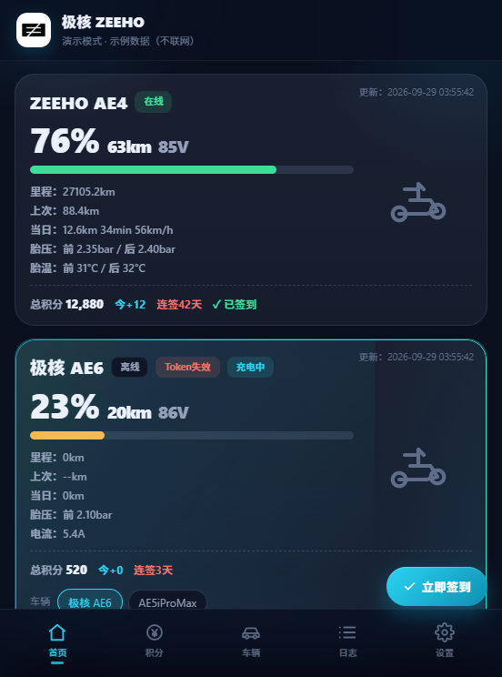
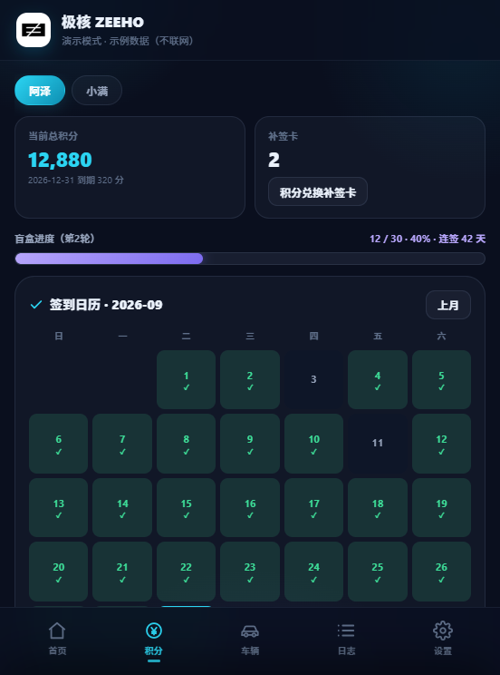
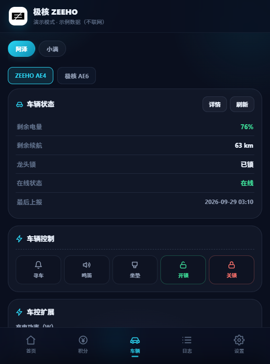
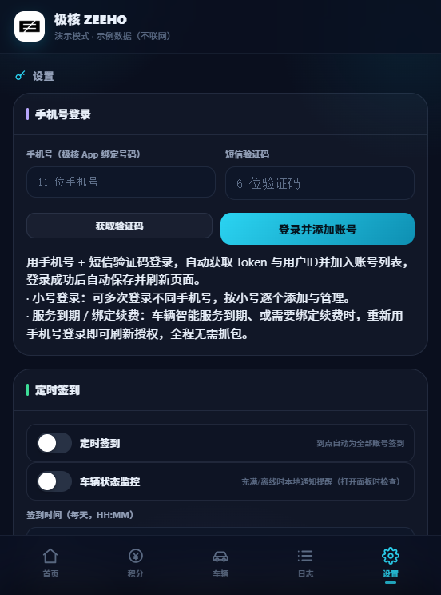

# ZEEHO
> ⚠️本项目仅用于学习研究，禁止商用，使用产生一切风险自行承担

极核ZEEHO电动车 **Loon / Quantumult X / Surge / Shadowrocket** 脚本：自动签到、社区积分任务、盲盒抽奖、车辆状态看板、远程车辆控制。HTML 可视化 BoxJS 面板，多账号管理，自动抓取 Token。另提供 **Windows 桌面版**、**iOS 版（TrollStore）** 与 **Scriptable 小组件脚本（单账号 / 多账号）**。

## ✨ 主要功能

### 📅 签到 & 积分任务
- 每日自动签到，统计连续签到天数（跨月连签不重置）
- 社区互动任务：发帖、点赞、评论、分享，自动清理临时动态
- 连续签到满 **30 天自动开启盲盒抽奖**
- 积分中心：积分明细、补签卡数量、签到日历、盲盒进度
- 多账号支持，账号异常**隔离运行**；签到限流自动退避重试

### 🚗 车辆状态监控（读取）
- SOC 电量、续航、电压、充电电流、充电状态
- 前后胎压、胎温、今日骑行里程/时长/最高速度
- 坐垫锁 / 整车锁 / 开关机 / 在线状态、GPS 定位 + 地图跳转、服务到期时间
- 充电监控：充满/离线本地通知提醒（后台常驻保活）

### 🎛️ 远程车辆控制（4G 下发指令）
> ⚠️ 会真实操作车辆，请在车辆附近谨慎操作，误触风险自负
> 首次使用需同意「车控风险确认」弹窗
1. 🔔 寻车（闪灯）
2. 📣 鸣笛寻车
3. 💺 弹开坐垫
4. 🔒 云端开关锁
5. ⚡ 充电功率设置

### 📱 iOS 桌面小组件（WidgetKit）
- 小/中/大三种规格：电量/续航/电压/签到/积分实时状态
- App Group 共享数据，WidgetCenter 通知刷新
- 设置页可选指定小组件显示的账号与车辆

### 🧩 Scriptable 小组件脚本（单账号版 / 多账号版）
> 免安装 App：配合 [Scriptable](https://scriptable.app) 使用，支持桌面小组件、锁屏小组件与快捷指令自动化

仓库提供两份独立脚本，功能一致（签到 / 盲盒 / 补签 / 发布 / 车控 / 充电监控 / 小组件），按需选择：

| 版本 | 文件 | 特点 |
| :-- | :-- | :-- |
| **单账号版** | [`script/Scriptable.js`](script/Scriptable.js) | 只维护一个账号，菜单精简，日常使用推荐 |
| **多账号版** | [`script/Scriptable-multi.js`](script/Scriptable-multi.js) | 多账号并存 + 并发签到，组件可按参数指定账号与车辆（`acc=账号ID&vin=车架号`） |

- 小组件：小 / 中 / 大（中尺寸显示电压）+ 锁屏圆形 / 锁屏长方形
- 自动流程：签到 → 盲盒 → 补签 → 发布动态（发布→点赞→分享→领分→删除）
- 车辆控制：寻车闪灯 / 鸣笛 / 开坐垫 / 云端开关锁（含风险确认）
- 快捷指令后台任务：`scriptable:///run/Scriptable?action=all&silent=1`（可选 `checkin` / `monitor` / `supplement`）

**使用步骤**：安装 Scriptable → 新建脚本 → 粘贴对应文件全文 → 运行一次，按菜单引导设置账号（「手机号登录」免抓包，或粘贴 Token）→ 在桌面 / 锁屏添加 Scriptable 小组件并选择该脚本。

### 🖥️ 桌面版（Windows）
- 托盘常驻、定时自动签到、开机自启
- 下载：[Releases](https://github.com/cluck798/ZEEHO/releases)（Setup 安装版 / Portable 便携版）

### 📱 iOS 版（TrollStore / 巨魔）
- WKWebView 面板 + 本地通知（签到结果、充电充满、车辆离线提醒）
- 后台常驻充电监控（静音保活 + 周期轮询）
- BackRun.dylib 注入（延长后台运行时间，TrollStore 自动注入）
- 品牌开屏（ZEEHO logo + 加载提示，页面就绪即撤下，数据随后填充）
- 安装信息检测（巨魔/企业签/个人自签/开发者）
- 下载：[ios-latest Release](https://github.com/cluck798/ZEEHO/releases/tag/ios-latest)，TrollStore 中点击 + 选择 IPA 安装，永久签名不掉签

## 🖼️ 在线演示 & 界面预览

> **在线演示（免安装、示例数据、不联网）**：https://cluck798.github.io/ZEEHO/
>
> 也可下载仓库内的 [`demo/index.html`](demo/index.html) 直接双击打开（单文件、无依赖），支持 `?tab=home|points|vehicle|logs|cfg` 直达标签页，例如 `demo/index.html?tab=vehicle`。

| 首页 | 积分 |
| :--: | :--: |
|  |  |

| 车辆 | 设置 |
| :--: | :--: |
|  |  |

## ⚠️ 注意事项
- `boxjs_store.json` 含 Token，已被 `.gitignore` 忽略，禁止提交
- App 更新导致接口加密变化时脚本可能失效，等待适配
- 使用第三方脚本存在账号风控风险，请自行评估
- 官方 App 登录会顶掉面板 Token，需重新抓取
- LOON插件订阅：https://raw.githubusercontent.com/cluck798/ZEEHO/refs/heads/main/modules/zeeho.plugin
- Surge模块订阅：https://raw.githubusercontent.com/cluck798/ZEEHO/refs/heads/main/modules/zeeho.sgmodule
- QX订阅：https://raw.githubusercontent.com/cluck798/ZEEHO/refs/heads/main/script/zeeho_qx.conf
- Shadowrocket配置：https://raw.githubusercontent.com/cluck798/ZEEHO/refs/heads/main/shadowrocket/zeeho.conf
- BOXJS订阅：https://raw.githubusercontent.com/cluck798/ZEEHO/refs/heads/main/script/boxjs/zeeho.boxjs.json
- 爱发电赞助：https://afdian.com/a/lucky798
